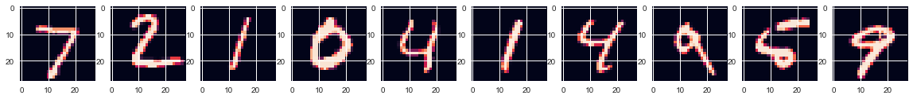
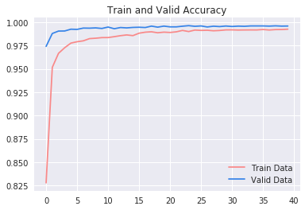
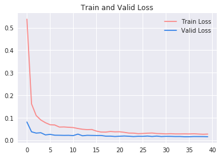

# Handwritten Digit Recognition based on Convolutional Neural Networks

Jiayi CUI,
Yang GAO,
Qingyang ZHONG

## Minst data set

## Training history

Convolutional Neural Networks

+ How CNN works
Convolutional Neural Networks take images as inputs for each neuron, perform a dot product and optionally follows it with a non-linearity. The whole network expresses a single differentiable score function from the image pixel class score.

Like normal neural networks, Convolutional neural networks have layers consist of a set of neurons. Neurons in each layer are connected to the neurons in the layer before them. While unlike normal neural networks, in CNN neurons in a layer are arranged in 3 dimensions: width, height and depth. Neurons in a layer are only connected to a small region of the previous layer. The final layer will output a single vector of class score, arranged along the depth dimension.

A basic CNN consists of the following 3 kinds of layers: convolutional layer, pooling layer and fully-connected layer. Each kind can have multiple layers in a convolutional neural network.

The convolutional layer is the core of CNN and does the heaviest computation. The convolutional layer?s parameters consist of a set of learnable filters, which are small blocks that goes along applied on the whole image through matrix multiplication. As each filter (kernel) slides over every pixel of the input image, it produces a 2D activation map and also obtains the response, to learn something different in the input image. We stack all the activation maps that filters produce along the depth dimension and forms the output image.

Pooling layers are inserted in-between convolutional layers to the spatial size and number of parameters. Pooling layers work through downsampling pixels, operating independently at every depth. For example, a pooling layer may pick the pixel with maximum value among every two neighboring pixels, and hereby reduces the volume size by 50 percent. Pooling layers reduce computation and decrease overfitting.

Fully-connected layer is a kind of layer whose neurons are fully connected to all activations in the previous layer. Therefore, those activations can be computed by matrix multiplication. The only difference between fully-connected layer and convolutional layer is local connectivity and fully connectivity. And because they both function through matrix multiplication, fully-connected layers and convolutional layers can be converted to one another. ?For any CONV layer there is an FC layer that implements the same forward function. The weight matrix would be a large matrix that is mostly zero except for at certain blocks (due to local connectivity) where the weights in many of the blocks are equal (due to parameter sharing).?

+ Parameters
Convolutional Layer
As mentioned above, CNN neurons are only connected to a small region of the previous layer. Such local connectivity is spatially defined by a hyperparameter, receptive field (F), which is the size of the kernel. For example, the size of the input matrix is 256*256*3, and the receptive field (the size of the filter) is 5*5, then each neuron in this convolutional layer will have weight=5*5*3 connectivity to the input image.

There are 3 hyperparameters controlling the size of the output image: depth, stride and zero-padding. Depth of the output volume, also known as fiber, is a hyperparameter that corresponds to the number of filters. It is defined as a set of neurons that activate at the same region of the input volume. Hyperparameter Stride (S) refers to how we slide the filters. If Stride=1, then we move the filter one pixel at a time. When stride=2, the filter moves two pixels at a time. Zero-padding (P) refers to the size of padding the pixels that have value 0 to the border.

The size of the output volume (W_out * H_out * D_out) can be computed by size of input volume (W_in * H_in * D_in), receptive field (F), Stride (S), Zero-padding (P) and kernel size (K). The formula is W_out = (W_in ? F + 2P)/S + 1, H_out = (H_in ? F + 2P)/S + 1. For example, input volume of size 9*9, with filter size 5*5, S = 1, P = 0, will get (9 ? 5 + 0)/1 + 1 = 5, so the output volume size is 5*5. Note that when W_in ? F + 2P produces an odd number, we can not use S = 2. When cases like this happens, there are constraints on stride. D_out = K.

Pooling Layer
Pooling layers have two hyperparameters, kernel size F, and stride S. The formula of calculating output volume size (W_out * H_out * D_out) using input volume (W_in * H_in * D_in) is:
W_out = (W_in - F)/S + 1, H_out = (H_in - F)/S + 1, D_out = D_in.
For example, a pooling layer with kernel size 2*2 reduces the volume size by 75%.

Fully-Connected Layer
Any FC layer can be converted to a CONV layer. For example, an FC layer with K = 4096 that is looking at some input volume of size 7*7*512 can be equivalently expressed as a CONV layer with F = 7, P = 0, S = 1, K = 2096. In other words, we are setting the filter size to be exactly the size of the input volume, and hence the output will simply be 1*1*4096 since only a single depth column ?fits? across the input volume, giving identical result as the initial FC layer.

Code Logic
Data Loading
This part is loading .gz files and encoding datasets. We use the last 10000 rows of the training data as validation data, and use the rest 50000 rows to fit the model.
Data Pre-processing
The preprocessing is mainly reshaping the data to be proper input volumes for CNN model. We reshape response y into dummy variables of size nrow*10. Since the value of each pixel ranges from 0 to 255, for better practical use, we normalize x to 0 to 1 floating point values. Because CNN deals with 3D images while we have 2D images, we reshape image matrixes to 28*28*1. Therefore, x has the size n*28*28*1.
Data Visualization
Visualizing the images of training set, test set and validation set.
Build CNN Model (Use Keras)
We start with a basic CNN model, setting batch size = 256, epochs = 40. To train the model, we use augmented training set to fit the model and validation set to do validation. Then we use a logarithmic loss function with the stochastic gradient optimization algorithm to find the best model parameter, and save the best model. We test the best model on test set and get 99.7 percent accuracy.

+ Starting Model
Layers of our starting model are:
1.	2D convolutional layer, F = 3*3, producing 32 feature maps
2.	2D convolutional layer, F = 3*3, producing 32 feature maps
3.	Pooling layer, F = 2*2
4.	Dropout layer, reduce set to 25 percent
5.	2D convolutional layer, F = 3*3, producing 64 feature maps
6.	2D convolutional layer, F = 3*3, producing 64 feature maps
7.	Pooling layer, F = 2*2
8.	Dropout layer, reduce set to 25 percent
9.	Flatten layer
10.	Fully connected layer with 256 units
11.	Dropout layer, reduce set to 50 percent
12.	Fully connected output layer with 10 units

+ Final model
To improve accuracy, we augment the training data by rotating, zooming, shifting, flipping, standardizing and normalizing the images, and use the augmented training set to fit the model.

+ Difficulties
The difficulties in implementing lay in finding the optimal values of parameters epochs, batch size, learning rate. With high computation cost of running the whole training dataset, it?s very time consuming running multiple times to find the optimal parameter values.

Although decreasing loss function and increasing the test accuracy is the first priority target to reach, it's so hard to identify some digits even with human eyes. These digits have such vague shapes that either human or computers can hardly recognize them correctly. After 40 epochs running, the training and validation loss function and accuracy move smoothly slow and keep stable. This means some digits may have actual trouble to classify.

+ Improvement
Adding 2 more convolutional layers (128 feature maps) may increase performance, but this will be even more computational expensive. Running with GPUs is a good way to improve the performance of the model, but it may spend a lot of money to train each possible parameter combinations.
Sample Code Debug
There is a conceptual error in model.fit() of the sample code. The validation data should not come from test data. Although validation data is not used to fit the model, it does affect the model in the training process. If we use test data as validation data, it will lead to overfitting. Therefore, we use validation_split instead, which choose 10 percent of the training data as validation data and use the rest 90 percent to fit the model.
